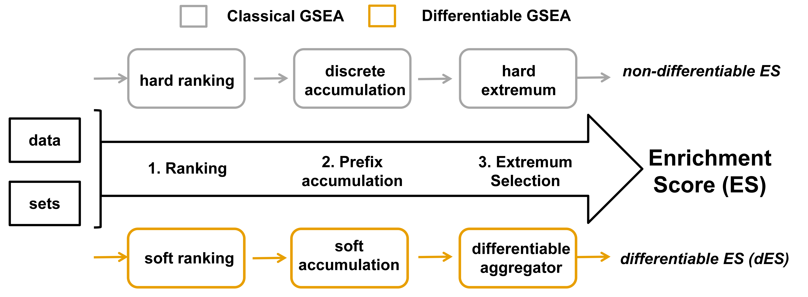
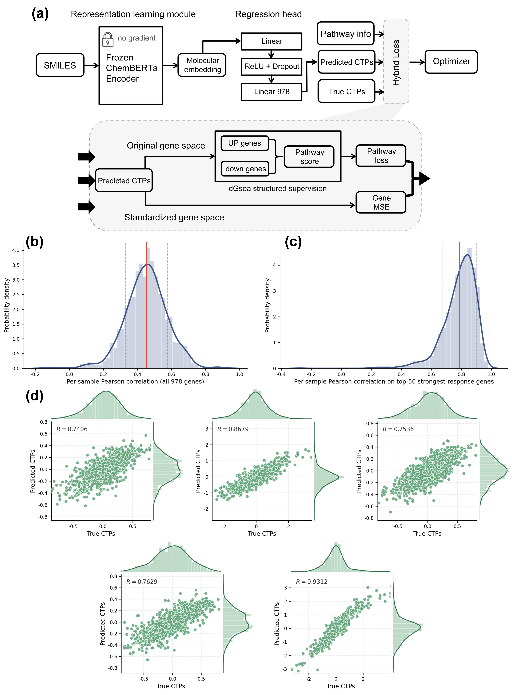

# dGSEA: Differentiable GSEA for Pathway-Level Supervision

dGSEA turns classical Gene Set Enrichment Analysis (GSEA) into a differentiable objective, enabling pathway-level supervision during model training.

---

## Method

Key idea:
- soft ranking replaces hard ranking  
- smooth accumulation replaces discrete prefix  
- differentiable aggregation replaces max deviation  

---

## Quick Start

### Smoke test

    python scripts/smoke_test.py

### Training reproduction

    python scripts/run_training_repro.py \
      --data-path /path/to/data.parquet \
      --model-dir /path/to/ChemBERTa

---

## Reproducibility

This repository supports:
- algorithm sanity check  
- full training reproduction  

Target: **conclusion-level consistency (not identical checkpoints)**

---

## Training Pipeline (optional)

---

## Citation

See `CITATION.cff`

---

## License

MIT
